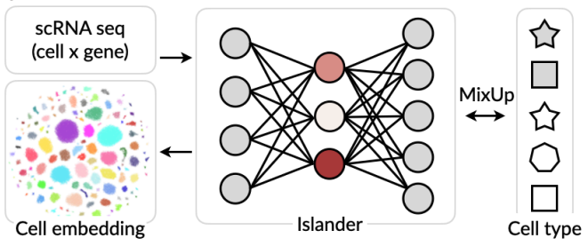

## Islander
This repository is the official implementation for the paper **Metric Mirages in Cell Embeddings**. 

Please contact wang.hanchen@gene.com or hanchenw@cs.stanford.edu if you have any questions.





### Citation

```bibtex
@article {Islander,
	author = {Hanchen Wang and Jure Leskovec and Aviv Regev},
	title = {Metric Mirages in Cell Embeddings},
	doi = {10.1101/2024.04.02.587824},
	publisher = {Cold Spring Harbor Laboratory},
	URL = {https://www.biorxiv.org/content/early/2024/04/02/2024.04.02.587824}
	journal = {bioRxiv},
	year = {2024},
}
```


---


### Usage

We include scripts and logs to reproduce the results in the <a href="scripts/">scripts</a> folder. You can also follow the step-by-step instructions below:

**Step 0**: Set up the environment.

```bash
conda env create -f env.yml
```

**NOTE**: The default setup uses GPU-compiled packages (for PyTorch, JAXlib, *etc*.). Please adjust them according to your local CUDA version *or* switch to the CPU version as needed. The calculation of scGraph scores does not require GPU access.

**Step 1**: Preprocessing. Data can be downloaded from:

| Brain                                                        | Breast                                                       | COVID                                                        | Eye                                                          | FetalGut                                                     | FetalLung                                                    | Heart                                                        | Lung                                                         | Pancreas                                                     | Skin                                                         |
| ------------------------------------------------------------ | ------------------------------------------------------------ | ------------------------------------------------------------ | ------------------------------------------------------------ | ------------------------------------------------------------ | ------------------------------------------------------------ | ------------------------------------------------------------ | ------------------------------------------------------------ | ------------------------------------------------------------ | ------------------------------------------------------------ |
| [Paper](https://www.science.org/doi/10.1126/science.add7046) | [Paper](https://www.nature.com/articles/s41586-023-06252-9)  | [Paper](https://www.ncbi.nlm.nih.gov/pmc/articles/PMC7402042/) | [Paper](https://www.sciencedirect.com/science/article/pii/S2666979X22001069?via%3Dihub) | [Paper](https://www.sciencedirect.com/science/article/pii/S1534580720308868?via%3Dihub) | [Paper](https://linkinghub.elsevier.com/retrieve/pii/S0092867422014155) | [Paper](https://www.nature.com/articles/s44161-022-00183-w)  | [Paper](https://www.nature.com/articles/s41591-023-02327-2)  | [Paper](https://www.nature.com/articles/s41592-021-01336-8)  | [Paper](https://www.nature.com/articles/s42003-020-0922-4)   |
| [Data](https://cellxgene.cziscience.com/collections/283d65eb-dd53-496d-adb7-7570c7caa443) | [Data](https://cellxgene.cziscience.com/collections/4195ab4c-20bd-4cd3-8b3d-65601277e731) | [Data](https://atlas.fredhutch.org/fredhutch/covid/)         | [Data](https://cellxgene.cziscience.com/collections/348da6dc-5bf6-435d-adc5-37747b9ae38a) | [Data](https://cellxgene.cziscience.com/collections/17481d16-ee44-49e5-bcf0-28c0780d8c4a) | [Data](https://cellxgene.cziscience.com/collections/2d2e2acd-dade-489f-a2da-6c11aa654028) | [Data](https://cellxgene.cziscience.com/collections/43b45a20-a969-49ac-a8e8-8c84b211bd01) | [Data](https://cellxgene.cziscience.com/collections/6f6d381a-7701-4781-935c-db10d30de293) | [Data](https://figshare.com/articles/dataset/Benchmarking_atlas-level_data_integration_in_single-cell_genomics_-_integration_task_datasets_Immune_and_pancreas_/12420968?file=24539828) | [Data](https://cellxgene.cziscience.com/collections/c353707f-09a4-4f12-92a0-cb741e57e5f0) |


We applied quality control to each dataset by filtering out cell profiles with fewer than 1,000 reads or fewer than 500 detected genes. Genes present in fewer than five cells were also excluded. Normalization was performed using Scanpy, where each cell’s read counts were scaled to a total of 10,000, followed by a log1p transformation:

```python
# download via "wget -O data/breast/local.h5ad https://datasets.cellxgene.cziscience.com/b8b5be07-061b-4390-af0a-f9ced877a068.h5ad"
adata = sc.read_h5ad(dh.DATA_RAW_["breast"])
adata.X = adata.raw.X
adata.layers["raw_counts"] = adata.raw.X
del adata.raw
uh.preprocess(adata)

[Output]
filtered out 9954 cells that have less than 1000 counts
filtered out 865 cells that have less than 500 genes expressed
filtered out 3803 genes that are detected in less than 5 cells
=============================================================================
29431 genes x 703512 cells after quality control.
=============================================================================
normalizing by total count per cell
    finished (0:00:06): normalized adata.X and added    'n_counts', counts per cell before normalization (adata.obs)
```


The top 1000 highly variable genes are selected through:

```python
sc.pp.highly_variable_genes(adata, subset=True, flavor="seurat_v3", n_top_genes=1000)
```

Then metadata is saved as JSON files. See the minimal example: [Process_Breast.ipynb](jupyter_nb/Process_Breast.ipynb).


**Step 2**: Run Islander and benchmark with scIB

```bash
cd ${HOME}/Islander/src

export LR=0.001
export EPOCH=10
export MODE="mixup"
export LEAKAGE=16
export MLPSIZE="128 128"
export DATASET_List=("lung" "lung_fetal_donor" "lung_fetal_organoid" \
    "brain" "breast" "heart" "eye" "gut_fetal" "skin" "COVID" "pancreas")

for DATASET in "${DATASET_List[@]}"; do
export PROJECT="_${DATASET}_"
export SavePrefix="${HOME}/Islander/models/${PROJECT}"
export RUNNAME="MODE-${MODE}-ONLY_LEAK-${LEAKAGE}_MLP-${MLPSIZE}"
echo "DATASET-${DATASET}_${RUNNAME}"
mkdir -p $SavePrefix

# === Training ===
python scTrain.py \
    --gpu 3 \
    --lr ${LR} \
    --mode ${MODE} \
    --epoch ${EPOCH} \
    --dataset ${DATASET} \
    --leakage ${LEAKAGE} \
    --project ${PROJECT} \
    --mlp_size ${MLPSIZE} \
    --runname "${RUNNAME}" \
    --savename "${SavePrefix}/${RUNNAME}";

# === Benchmarking ===
python scBenchmarker.py \
    --islander \
    --saveadata \
    --dataset "${DATASET}" \
    --save_path "${SavePrefix}/${RUNNAME}";
done
```


We have also provided variants of Islander, which make use of different forms of semi-supervised learning loss (triplet and supervised contrastive loss). See [scripts/_Islander_SCL.sh](scripts/_Islander_SCL.sh) and [scripts/_Islander_Triplet.sh](scripts/_Islander_Triplet.sh) for details.


**Step 3**: Run integration methods and benchmark with scIB

```bash
export DATASET_List="lung_fetal_donor"
echo -e "\n\n"

echo "DATASET-${DATASET}_HVG"
export CUDA_VISIBLE_DEVICES=2 & python scBenchmarker.py \
    --all \
    --highvar \
    --saveadata \
    --dataset "${DATASET}" \
    --savecsv "${DATASET}_FULL" \
    --save_path "${HOME}/Islander_dev/models/_${DATASET}_/MODE-mixup-ONLY_LEAK-16_MLP-128 128";
   
# === highly variable genes ===
echo "DATASET-${DATASET}_HVG"
export CUDA_VISIBLE_DEVICES=2 & python scBenchmarker.py \
	--all \
	--highvar \
	--saveadata \
	--dataset "${DATASET}" \
	--savecsv "${DATASET}_HVG" \
	--save_path "${HOME}/Islander_dev/models/_${DATASET}_/MODE-mixup-ONLY_LEAK-16_MLP-128 128";
```


**Step 4**: Run and benchmark foundation models

Please refer to the authors' original tutorials ([scGPT](https://github.com/bowang-lab/scGPT/tree/main/tutorials/zero-shot), [Geneformer](https://huggingface.co/ctheodoris/Geneformer/tree/main/examples), [scFoundation](https://github.com/biomap-research/scFoundation/tree/main/model), [UCE](https://github.com/snap-stanford/UCE)) for extracting zero-shot and fine-tuned cell embeddings. We provide a minimal example notebook [_nb/Geneformer_Skin.ipynb](jupyter_nb/Geneformer_Skin.ipynb) to extract zero-shot cell embeddings for the skin dataset using pre-trained Geneformer. To evaluate such embedding with scIB:

```bash
cd ${HOME}/Islander/src

export DATASET="brain"
echo -e "\n\n"
echo "DATASET-${DATASET}_Geneformer"
python scBenchmarker.py \
    --obsm_keys Geneformer \
    --dataset "${DATASET}" \
    --savecsv "${DATASET}_Geneformer" \
    --save_path "${HOME}/Islander/models/_${skin}_/MODE-mixup-ONLY_LEAK-16_MLP-128 128";

```


**Step 5**: Benchmark with scGraph (can be replaced on customized AnnData file)

```bash
cd ${HOME}/Islander/src

python scGraph.py \
    --adata_path ${HOME}/Islander/data/lung/emb.h5ad \
    --batch_key sample \
    --label_key cell_type \
    --savename ${HOME}/lung_scGraph;
```

The output file is in the format **Corr-Weights**, reported as scGraph scores in the paper. It is based on weighted rank correlation, where the weights are inversely proportional to the inter-cluster centroid distances. **Corr-PCA** represents the rank correlation using equal weights. **Rank-PCA** represents rank differences.

|             | Rank-PCA | Corr-PCA | Corr-Weights |
| :---------- | -------: | -------: | -----------: |
| Geneformer  |    0.610 |    0.799 |        0.498 |
| Harmony     |    0.670 |    0.924 |        0.678 |
| Harmony_hvg |    0.709 |    0.941 |        0.724 |
| Islander    |    0.292 |    0.847 |        0.160 |


**Parameter Settings in scGraph**:

scGraph uses PCA for each cell type within each batch to represent cluster-cluster relationships. Batches with fewer than 100 cells or cell types with fewer than 10 cells are excluded. PCA is calculated on the 1,000 highly variable genes, after removing 10% of the cells (5% from each extreme).

All the numerical values mentioned above are adjustable. For further details, please refer to `scGraph.py`.

---


**Step X**: Case study scGraph vs scIB on fibroblast cells from the human fetal lung

Please see [Fibroblast_Case.ipynb](jupyter_nb/Fibroblast_Case.ipynb) to reproduce the results reported in the paper.


### File Organization

```
├── LICENSE.txt
├── README.md
├── data
├── env.yml  # for GPU environments
├── jupyter_nb
│   ├── Fibroblast_Case.ipynb
│   ├── Geneformer_Skin.ipynb
│   └── Process_Breast.ipynb
├── meta
│   ├── COVID
│   │   ├── batch2cat.json
│   │   └── cell2cat.json
│   ├── ...
├── res
│   └── scGraph
│   └── scIB
├── scripts
│   ├── Lung_Mixup.log 
│   ├── Lung_scGraph.log
│   ├── _Islander_MixUp.sh
│   ├── _Islander_SCL.sh
│   ├── _Islander_Triplet.sh
│   ├── _download_data.sh
│   ├── _scBenchmark.sh
│   ├── _scGraph.sh
│   ├── _scIB_Geneformer.sh
│   └── _scIB_Islander.sh  # scib benchmark on cell islands embeddings
├── src
│   ├── ArgParser.py
│   ├── Data_Handler.py
│   ├── Utils_Handler.py
│   ├── Vis_Handler.py
│   ├── __init__.py
│   ├── scBenchmarker.py
│   ├── scDataset.py
│   ├── scFinetuner.py
│   ├── scGraph.py
│   ├── scLoss.py
│   ├── scModel.py
│   └── scTrain.py
└── teaser.png
```


